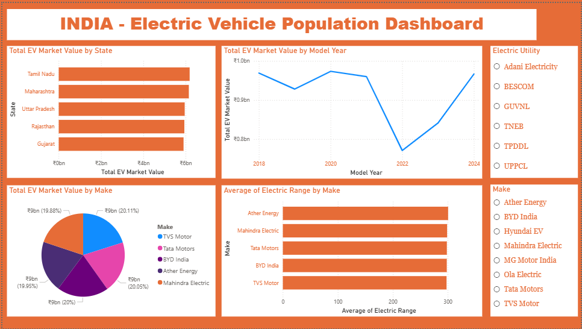

# EV Data Analysis

## 📊 Overview

This project analyzes Electric Vehicle (EV) data to understand market trends, regional performance, and manufacturer comparison.

## 🛠 Tools Used

* Power BI

## 🔍 Key Insights

* EV adoption shows an overall upward trend
* Maharashtra and Tamil Nadu lead EV market value
* Market shows a dip around 2022 followed by recovery

## 📈 Dashboard

## 🎯 Conclusion

The EV market is growing with strong regional dominance and increasing adoption trends.
